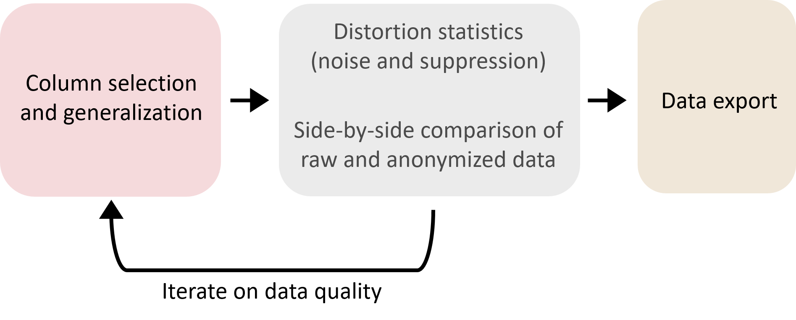

# Operation

> To report feature requests or problem, please contact us at [feedback@open-diffix.org](mailto:feedback@open-diffix.org).

Easy Diffix has three phases of operation:
- Load and configure table from CSV
- Select data and adjust quality
  - Select columns for anonymization
  - Select amount of data generalization
  - Examine data quality and adjust selected columns and generalization as needed
- Export anonymized data as CSV

An unlimited number of anonymized views of the data may be exported without compromising anonymity.

## Load table from CSV

Easy Diffix only accepts CSV files as input.

Easy Diffix interprets the first row of the CSV file as column names.

Easy Diffix auto-detects the CSV separator. All standard separators are accepted.

Easy Diffix auto-detects data types as text or numeric. Text columns are generalized with substring selection, and numeric columns are generalized with numeric ranges.

After loading, Easy Diffix displays the column names and the first 1000 rows of the table. This data may be inspected to validate that the CSV file was loaded correctly.

## IMPORTANT: Configure the Protected Entity Identifier Column

In order for Easy Diffix to anonymize properly, the column containing the protected entity identifier must be correctly configured.

The **protected entity** is the entity whose privacy is being protected. A protected entity is usually a person, but it could be something else, for instance an account, a family, or even an organization.

Some data sets have one row of data per protected entity. Examples include survey data, demographic data, and census data. For example:

| Gender | Zip Code | Age | Education | Job | ... |
| --- | --- | --- | --- | --- | --- |
| M | 12345 | 46 | High School | Plumber | ... |
| O | 54321 | 23 | Bachelor | None | ... |
| F | 48572 | 32 | PhD | Professor | ... |

These *one-row* data sets often do not have any kind identifier column. The Protected Entity Identifier Column may be set to `None`. Easy Diffix treats each row as a protected entity.

Other data sets have multiple rows of data per protected entity. Examples include time series data like geo-location, hospital visits, and website visits. These data sets usually have one or more columns that identify the protected identity. For instance, the following is a geo-location data set where the IMEI (International Mobile Equipment Identifier) identifies the protected entity. In this case, the protected entity itself is a mobile device, but this serves as a proxy for a person.

| IMEI | Time | Latitude | Longitude |
| --- | --- | --- | --- |
| 123 | 2021-10-01 21:34:19 | 43.27366 | 81.36623 |
| 123 | 2021-10-01 21:36:21 | 43.43884 | 81.39229 |
| 123 | 2021-10-01 22:02:51 | 43.81922 | 81.40221 |
| ... | ... | ... | ... |
| 456 | 2021-02-13 17:34:19 | -17.27366 | 67.36623 |
| 456 | 2021-02-13 17:36:21 | -17.43884 | 67.39229 |
| 456 | 2021-02-13 17:02:51 | -17.67883 | 81.40221 |
| ... | ... | ... | ... |

For this *multi-row* data set, the IMEI column is configured in Easy Diffix as the Protected Entity Identifier Column. If a different column were configured as the Protected Entity Identifier Column, then Easy Diffix would not anonymize correctly.

In some multi-row data sets, a single row may pertain to multiple different protected entities. Examples include bank transactions, email records, and call records. Here is an example of a data set for email records:

|Record ID | Sender email | Receiver email | Time | ... |
| 1234 | a@b.com | c@d.com | 2021-10-01 21:34:19 | ... |
| 1235 | a@b.com | e@f.com | 2021-10-01 21:36:21 | ... |
| 1236 | c@d.com | e@f.com | 2021-10-01 22:02:51 | ... |
| ... | ... | ... | ... | ... |

The `Sender email` and `Receiver email` each identify a different protected entity.

> **This version of Easy Diffix does not protect a data set where there are multiple protected entities per row**

A data set with multiple protected entities needs to be pre-processed to have one protected entity per row before loading into Easy Diffix. For example, the above email data set could be split into two data sets, one without the `Receiver email` column, and the other without the `Sender email` column. Note in particular that simply pseudonymizing one or the other of the email columns would **not** suffice in providing strong anonymity: the complete column must be removed.

A future version of Easy Diffix will support data sets with multiple protected entities per row. Please contact us at
[feedback@open-diffix.org](mailto:feedback@open-diffix.org) if this feature is important to you.

## Select columns and generalization

Like all data anonymization mechanisms, Diffix distorts and hides data. The more columns included and the finer the data granularity, the more distortion and hiding. Diffix distorts by adding *noise* to counts, and hides data by *suppressing* bins that pertain to too few protected entities.

Easy Diffix lets you control the quality of the anonymized data through column selection and column generalization (binning). It lets you inspect the quality of the anonymized data at a glance with *distortion statistics* and in detail with *side-by-side comparison* of the anonymized and raw data. Through an iterative process of column selection and generalization, and anonymized data inspection, Easy Diffix simplifies the task of data anonymization.

Columns are selected for inclusion in the anonymized data output using the radial buttons. As soon as a column is selected, Easy Diffix starts computing the anonymized output. If another column is selected or de-selected before the computing finishes, then the computation is halted and a new computation started.

When a column is selected, the generalization input is exposed. For text columns, you can select a substring by offset and number of characters. For numeric columns, you can select a bin size.

> More generalization (larger substrings or no substring, and larger bins) leads to less suppression and less relative noise.

## How to interpret the distortion summary

